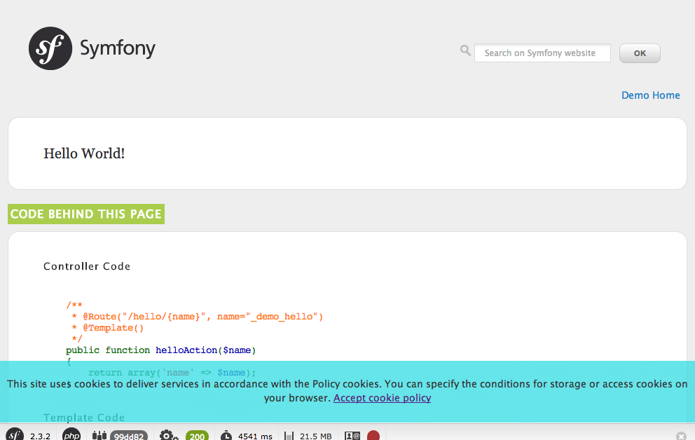

# YproximiteCookieAcknowledgementBundle

This bundle provides information about an cookies usage, which is forced by European Union by so-called [EU cookie law](http://www.ico.org.uk/for_organisations/privacy_and_electronic_communications/the_guide/cookies).

It includes:

- fast & easy integration and short learning curve
- automatic cookie bar injection on the bottom of the page
- ability to manually inject cookie bar (for example for iframes)
- ability to change text and "close button" name
- locale aware
- ability to provide own cookie bar template

This bundle requires Multibyte String extension.



## Installation

Configure Composer to use packagist.com repository:
```json
{
    "repositories": [
        {
            "type": "composer",
            "url": "https://repo.packagist.com/yproximite/"
        },
        {
            "packagist.org": false
        }
    ]
}
```

Then run: 
```console
$ composer require yproximite/cookie-acknowledgement-bundle
```

## Usage

### For all static pages

By default the cookie bar will be visible on every page after turning on bundle.

### For iframes

Disable response injection in `config/packages/yproximite_cookie_acknowledgment_.yaml`:

    yproximite_cookie_acknowledgement:
        response_injection: false

Include cookie bar in appropriate location

    

## Configuration options

Configuration can be adjusted in `config/packages/yproximite_cookie_acknowledgment_.yaml`:

    yproximite_cookie_acknowledgement:
        response_injection: true # default true
        template: custom_cookie_bar.html.twig # twig template name, default: '@YproximiteCookieAcknowledgement/cookie_acknowledgement_bar.html.twig'

### Altering cookie bar texts

Place tranlations file in your project directory:

    `translations/YproximiteCookieAcknowledgementBundle.en.yml`

And change texts:

    cookie.message: My message
    cookie.message.accept: Accept button text

Of course you can set up those texts in as many locales as you want.

### Altering cookie bar appearance

By default cookie bar comes with some default styles. If you wish to change those, use CSS. 
For example you may want pink background with placement on top of the page:

    #cookie-law-info-bar {
        background: pink !important;
        top: 50px !important;
        bottom: auto !important;
    }

Please note that every style needs ```!important``` to override provided inline styles.

### Altering whole cookie bar template

You use your own template by setting it in the configuration:

    yproximite_cookie_acknowledgement:
        template: custom_cookie_bar.html.twig

In above case template is located in `templates/custom_cookie_bar.html.twig`.

Also base template can be reused be Twig extension (two blocks are used: `yproximite_cookie_message` and `yproximite_cookie_message_js`), see example below:

    

    
        {{ parent() }}
        <div>This is something custom</div>
    

    
        {{ parent() }}
        <script type="text/javascript">
            document.getElementById('js-cookie-law-close-button').onclick = function () {
                alert('Got ya!');
            }
        </script>
    
